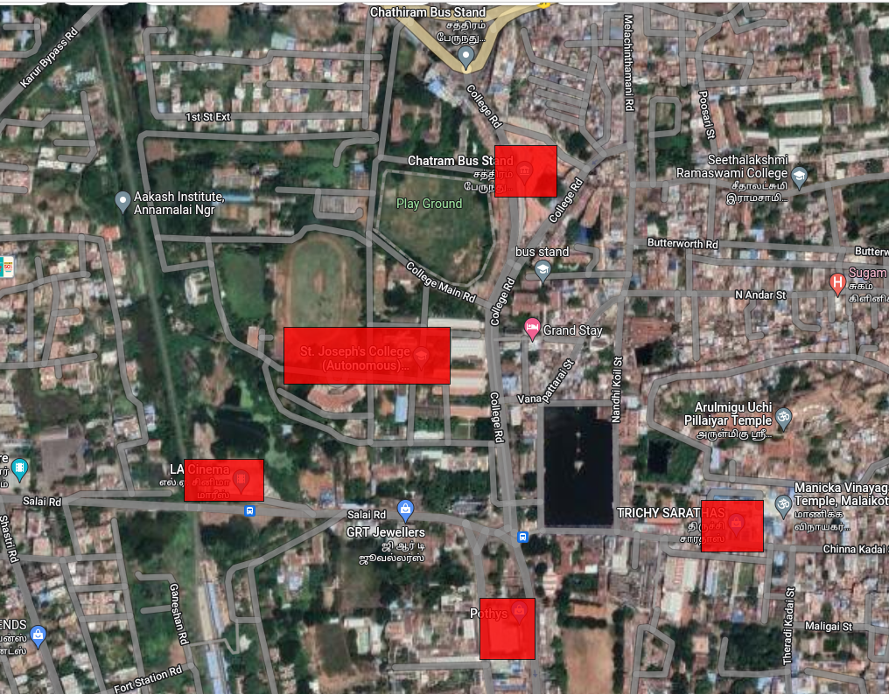
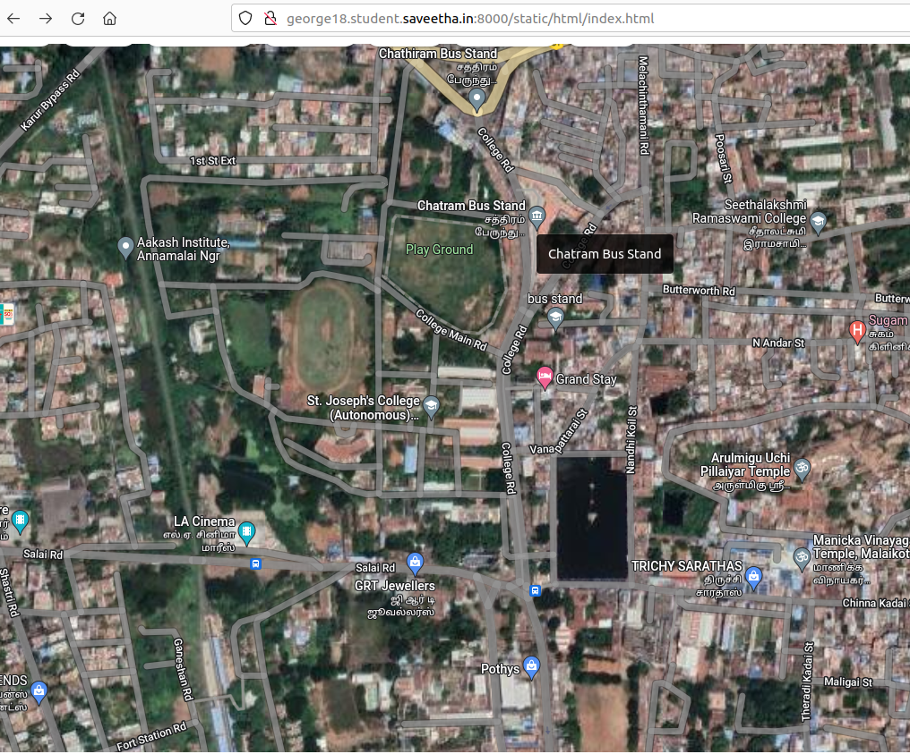
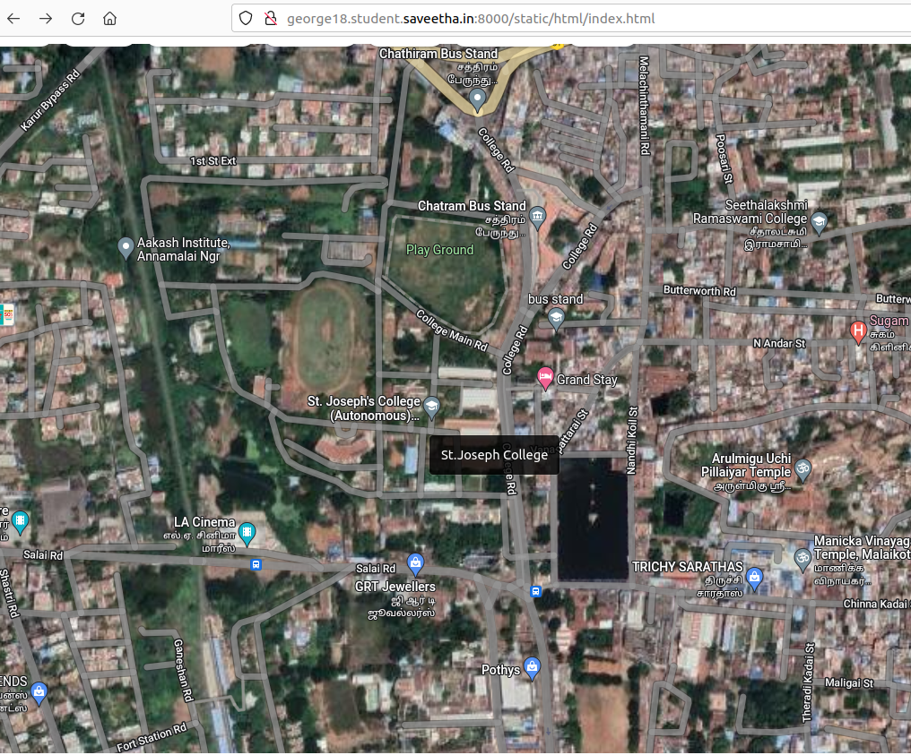
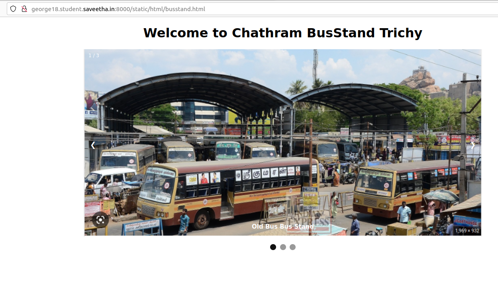
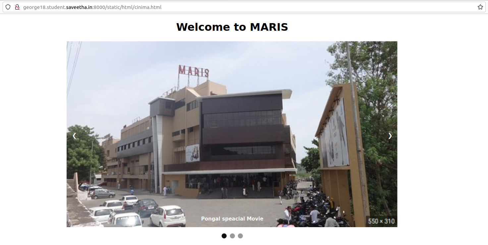
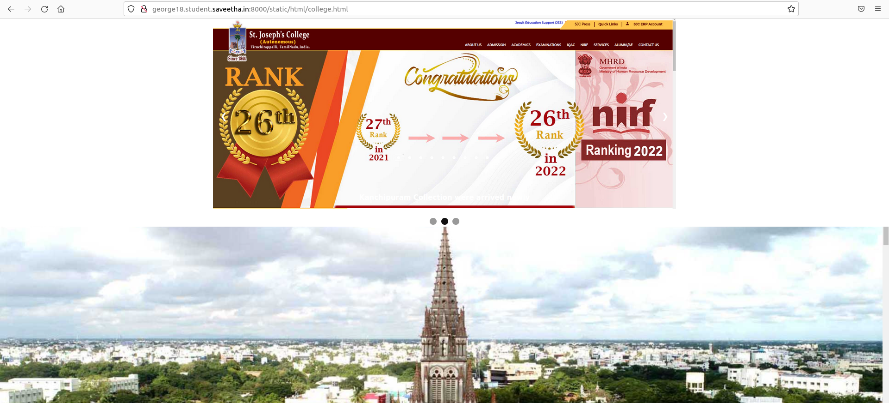
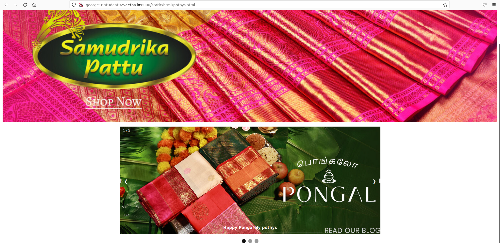
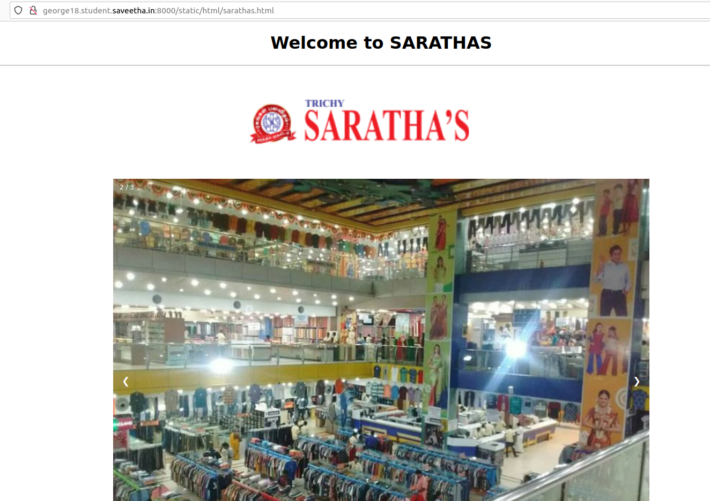

# Places Around Me
## AIM:
To develop a website to display details about the places around my house.

## Design Steps:

### Step 1:

Create a folder and clone tha repository in it.

### Step 2:

Create a folder named statis and on that create html folder and inside that creater index.html

### Step 3:

Then go to maps and take a screenshot of your own. Then put in image mapping and map a place to need.

### Step 4:

Get the code of the mapped place and put the code in index.html.
Create some some html files inside the index.html code.

### Step 5:

Now run the server.  It will give the selected map and details of the marked place. 

## Code:

### index.html code:

```
<!DOCTYPE html>
<html>
    <head></head>
    <body>
        
        <map name="image-maps-2023-01-13-101525" id="ImageMapsCom-image-maps-2023-01-13-101525">
        <area  alt="" title="Chatram Bus Stand" href="busstand.html" shape="rect" coords="566,163,638,223" style="outline:none;" target="_self"     />
        <area shape="rect" coords="1016,790,1018,792" alt="Image Map" style="outline:none;" title="Image Map" href="https://www.image-maps.com/" />
        <area  alt="" title="Sarathas" href="sarathas.html" shape="rect" coords="802,569,874,629" style="outline:none;" target="_self"     />
        <area shape="rect" coords="1016,790,1018,792" alt="Image Map" style="outline:none;" title="Image Map" href="https://www.image-maps.com/" />
        <area  alt="" title="St.Joseph College" href="college.html" shape="rect" coords="325,371,516,437" style="outline:none;" target="_self"     />
        <area shape="rect" coords="1016,790,1018,792" alt="Image Map" style="outline:none;" title="Image Map" href="https://www.image-maps.com/" />
        <area  alt="" title="Pothys" href="pothys.html" shape="rect" coords="549,681,613,752" style="outline:none;" target="_self"     />
        <area shape="rect" coords="1016,790,1018,792" alt="Image Map" style="outline:none;" title="Image Map" href="https://www.image-maps.com/" />
        <area  alt="" title="Theater " href="cinima.html" shape="rect" coords="211,522,303,571" style="outline:none;" target="_self"     />
        <area shape="rect" coords="1016,790,1018,792" alt="Image Map" style="outline:none;" title="Image Map" href="https://www.image-maps.com/" />
    </map>
    </body>
</html>
```

### busstand.html code:

```
<!DOCTYPE html>
<html>
  <head>
    <title>Slideshow Images</title>
    <style>
      * {
        box-sizing: border-box
      }
      body {
        font-family: Verdana, sans-serif;
        margin: 0
      }
      .mySlides {
        display: none
      }
      img {
        vertical-align: middle;
      }
      .slideshow-container {
        max-width: 1000px;
        position: relative;
        margin: auto;
      }
      /* Next & previous buttons */
      .prev,
      .next {
        cursor: pointer;
        position: absolute;
        top: 50%;
        width: auto;
        padding: 16px;
        margin-top: -22px;
        color: white;
        font-weight: bold;
        font-size: 18px;
        transition: 0.6s ease;
        border-radius: 0 3px 3px 0;
        user-select: none;
      }
      /* Position the "next button" to the right */
      .next {
        right: 0;
        border-radius: 3px 0 0 3px;
      }
      /* On hover, add a black background color with a little bit see-through */
      .prev:hover,
      .next:hover {
        background-color: rgba(0, 0, 0, 0.8);
      }
      /* Caption text */
      .text {
        color: #ffffff;
        font-size: 15px;
        padding: 8px 12px;
        position: absolute;
        bottom: 8px;
        width: 100%;
        text-align: center;
      }
      /* Number text (1/3 etc) */
      .numbertext {
        color: #ffffff;
        font-size: 12px;
        padding: 8px 12px;
        position: absolute;
        top: 0;
      }
      /* The dots/bullets/indicators */
      .dot {
        cursor: pointer;
        height: 15px;
        width: 15px;
        margin: 0 2px;
        background-color: #999999;
        border-radius: 50%;
        display: inline-block;
        transition: background-color 0.6s ease;
      }
      .active,
      .dot:hover {
        background-color: #111111;
      }
      /* Fading animation */
      .fade {
        -webkit-animation-name: fade;
        -webkit-animation-duration: 1.5s;
        animation-name: fade;
        animation-duration: 1.5s;
      }
      @-webkit-keyframes fade {
        from {
          opacity: .4
        }
        to {
          opacity: 1
        }
      }
      @keyframes fade {
        from {
          opacity: .4
        }
        to {
          opacity: 1
        }
      }
      /* On smaller screens, decrease text size */
      @media only screen and (max-width: 300px) {
        .prev,
        .next,
        .text {
          font-size: 11px
        }
      }
    </style>
  </head>
  <body>
    <h1 align="center"><b>Welcome to Chathram BusStand Trichy</b></h1>
    <div class="slideshow-container">
      <div class="mySlides fade">
        <div class="numbertext">1 / 3</div>
        
        <div class="text"><b>Old Bus Bus Stand</b></div>
      </div>
      <div class="mySlides fade">
        <div class="numbertext">2 / 3</div>
        
        <div class="text"><b>New Bus Stand renovated</b></div>
      </div>
      <div class="mySlides fade">
        <div class="numbertext">3 / 3</div>
        
        <div class="text"><b>New Bus Stand renovated</b></div>
      </div>
      <a class="prev" onclick="plusSlides(-1)">&#10094;</a>
      <a class="next" onclick="plusSlides(1)">&#10095;</a>
    </div>
    <br>
    <div style="text-align:center">
      <span class="dot" onclick="currentSlide(0)"></span>
      <span class="dot" onclick="currentSlide(1)"></span>
      <span class="dot" onclick="currentSlide(2)"></span>
    </div>
    <script>
      let slideIndex = 0;
      let timeoutId = null;
      const slides = document.getElementsByClassName("mySlides");
      const dots = document.getElementsByClassName("dot");
      
      showSlides();
      function currentSlide(index) {
           slideIndex = index;
           showSlides();
      }
     function plusSlides(step) {
        
        if(step < 0) {
            slideIndex -= 2;
            
            if(slideIndex < 0) {
              slideIndex = slides.length - 1;
            }
        }
        
        showSlides();
     }
      function showSlides() {
        for(let i = 0; i < slides.length; i++) {
          slides[i].style.display = "none";
          dots[i].classList.remove('active');
        }
        slideIndex++;
        if(slideIndex > slides.length) {
          slideIndex = 1
        }
        slides[slideIndex - 1].style.display = "block";
        dots[slideIndex - 1].classList.add('active');
         if(timeoutId) {
            clearTimeout(timeoutId);
         }
        timeoutId = setTimeout(showSlides, 5000); // Change image every 5 seconds
      }
    </script>
  </body>
</html>
```

### cinima.html code:

```
<!DOCTYPE html>
<html>
  <head>
    <title>Slideshow Images</title>
    <style>
      * {
        box-sizing: border-box
      }
      body {
        font-family: Verdana, sans-serif;
        margin: 0
      }
      .mySlides {
        display: none
      }
      img {
        vertical-align: middle;
      }
      .slideshow-container {
        max-width: 1000px;
        position: relative;
        margin: auto;
      }
      /* Next & previous buttons */
      .prev,
      .next {
        cursor: pointer;
        position: absolute;
        top: 50%;
        width: auto;
        padding: 16px;
        margin-top: -22px;
        color: white;
        font-weight: bold;
        font-size: 18px;
        transition: 0.6s ease;
        border-radius: 0 3px 3px 0;
        user-select: none;
      }
      /* Position the "next button" to the right */
      .next {
        right: 0;
        border-radius: 3px 0 0 3px;
      }
      /* On hover, add a black background color with a little bit see-through */
      .prev:hover,
      .next:hover {
        background-color: rgba(0, 0, 0, 0.8);
      }
      /* Caption text */
      .text {
        color: #ffffff;
        font-size: 15px;
        padding: 8px 12px;
        position: absolute;
        bottom: 8px;
        width: 100%;
        text-align: center;
      }
      /* Number text (1/3 etc) */
      .numbertext {
        color: #ffffff;
        font-size: 12px;
        padding: 8px 12px;
        position: absolute;
        top: 0;
      }
      /* The dots/bullets/indicators */
      .dot {
        cursor: pointer;
        height: 15px;
        width: 15px;
        margin: 0 2px;
        background-color: #999999;
        border-radius: 50%;
        display: inline-block;
        transition: background-color 0.6s ease;
      }
      .active,
      .dot:hover {
        background-color: #111111;
      }
      /* Fading animation */
      .fade {
        -webkit-animation-name: fade;
        -webkit-animation-duration: 1.5s;
        animation-name: fade;
        animation-duration: 1.5s;
      }
      @-webkit-keyframes fade {
        from {
          opacity: .4
        }
        to {
          opacity: 1
        }
      }
      @keyframes fade {
        from {
          opacity: .4
        }
        to {
          opacity: 1
        }
      }
      /* On smaller screens, decrease text size */
      @media only screen and (max-width: 300px) {
        .prev,
        .next,
        .text {
          font-size: 11px
        }
      }
    </style>
  </head>
  <body>
    <h1 align="center"><b>Welcome to MARIS</b></h1>
    <div class="slideshow-container">
      <div class="mySlides fade">
        <div class="numbertext">1 / 3</div>
        
        <div class="text"><b>Pongal speacial Movie</b></div>
      </div>
      <div class="mySlides fade">
        <div class="numbertext">2 / 3</div>
        
        <div class="text"><b>Varisu movie on housefull</b></div>
      </div>
      <div class="mySlides fade">
        <div class="numbertext">3 / 3</div>
        
        <div class="text"><b>Thuni becoming blockbuster</b></div>
      </div>
      <a class="prev" onclick="plusSlides(-1)">&#10094;</a>
      <a class="next" onclick="plusSlides(1)">&#10095;</a>
    </div>
    <br>
    <div style="text-align:center">
      <span class="dot" onclick="currentSlide(0)"></span>
      <span class="dot" onclick="currentSlide(1)"></span>
      <span class="dot" onclick="currentSlide(2)"></span>
    </div>
    <script>
      let slideIndex = 0;
      let timeoutId = null;
      const slides = document.getElementsByClassName("mySlides");
      const dots = document.getElementsByClassName("dot");
      
      showSlides();
      function currentSlide(index) {
           slideIndex = index;
           showSlides();
      }
     function plusSlides(step) {
        
        if(step < 0) {
            slideIndex -= 2;
            
            if(slideIndex < 0) {
              slideIndex = slides.length - 1;
            }
        }
        
        showSlides();
     }
      function showSlides() {
        for(let i = 0; i < slides.length; i++) {
          slides[i].style.display = "none";
          dots[i].classList.remove('active');
        }
        slideIndex++;
        if(slideIndex > slides.length) {
          slideIndex = 1
        }
        slides[slideIndex - 1].style.display = "block";
        dots[slideIndex - 1].classList.add('active');
         if(timeoutId) {
            clearTimeout(timeoutId);
         }
        timeoutId = setTimeout(showSlides, 5000); // Change image every 5 seconds
      }
    </script>
  </body>
</html>
```

### college.html code:

```
<!DOCTYPE html>
<html>
  <head>
    <title>Slideshow Images</title>
    <style>
      * {
        box-sizing: border-box
      }
      body {
        font-family: Verdana, sans-serif;
        margin: 0
      }
      .mySlides {
        display: none
      }
      img {
        vertical-align: middle;
      }
      .slideshow-container {
        max-width: 1000px;
        position: relative;
        margin: auto;
      }
      /* Next & previous buttons */
      .prev,
      .next {
        cursor: pointer;
        position: absolute;
        top: 50%;
        width: auto;
        padding: 16px;
        margin-top: -22px;
        color: white;
        font-weight: bold;
        font-size: 18px;
        transition: 0.6s ease;
        border-radius: 0 3px 3px 0;
        user-select: none;
      }
      /* Position the "next button" to the right */
      .next {
        right: 0;
        border-radius: 3px 0 0 3px;
      }
      /* On hover, add a black background color with a little bit see-through */
      .prev:hover,
      .next:hover {
        background-color: rgba(0, 0, 0, 0.8);
      }
      /* Caption text */
      .text {
        color: #ffffff;
        font-size: 15px;
        padding: 8px 12px;
        position: absolute;
        bottom: 8px;
        width: 100%;
        text-align: center;
      }
      /* Number text (1/3 etc) */
      .numbertext {
        color: #ffffff;
        font-size: 12px;
        padding: 8px 12px;
        position: absolute;
        top: 0;
      }
      /* The dots/bullets/indicators */
      .dot {
        cursor: pointer;
        height: 15px;
        width: 15px;
        margin: 0 2px;
        background-color: #999999;
        border-radius: 50%;
        display: inline-block;
        transition: background-color 0.6s ease;
      }
      .active,
      .dot:hover {
        background-color: #111111;
      }
      /* Fading animation */
      .fade {
        -webkit-animation-name: fade;
        -webkit-animation-duration: 1.5s;
        animation-name: fade;
        animation-duration: 1.5s;
      }
      @-webkit-keyframes fade {
        from {
          opacity: .4
        }
        to {
          opacity: 1
        }
      }
      @keyframes fade {
        from {
          opacity: .4
        }
        to {
          opacity: 1
        }
      }
      /* On smaller screens, decrease text size */
      @media only screen and (max-width: 300px) {
        .prev,
        .next,
        .text {
          font-size: 11px
        }
      }
    </style>
  </head>
  <body>
    <div class="slideshow-container">
      <div class="mySlides fade">
        <div class="numbertext">1 / 3</div>
        
        <div class="text"><b>Happy Pongal to all</b></div>
      </div>
      <div class="mySlides fade">
        <div class="numbertext">2 / 3</div>
        
        <div class="text"><b>Welcome to SJC</b></div>
      </div>
      <div class="mySlides fade">
        <div class="numbertext">3 / 3</div>
        
        <div class="text"><b>be the best</b></div>
      </div>
      <a class="prev" onclick="plusSlides(-1)">&#10094;</a>
      <a class="next" onclick="plusSlides(1)">&#10095;</a>
    </div>
    <br>
    <div style="text-align:center">
      <span class="dot" onclick="currentSlide(0)"></span>
      <span class="dot" onclick="currentSlide(1)"></span>
      <span class="dot" onclick="currentSlide(2)"></span>
    </div>
    <script>
      let slideIndex = 0;
      let timeoutId = null;
      const slides = document.getElementsByClassName("mySlides");
      const dots = document.getElementsByClassName("dot");
      
      showSlides();
      function currentSlide(index) {
           slideIndex = index;
           showSlides();
      }
     function plusSlides(step) {
        
        if(step < 0) {
            slideIndex -= 2;
            
            if(slideIndex < 0) {
              slideIndex = slides.length - 1;
            }
        }
        
        showSlides();
     }
      function showSlides() {
        for(let i = 0; i < slides.length; i++) {
          slides[i].style.display = "none";
          dots[i].classList.remove('active');
        }
        slideIndex++;
        if(slideIndex > slides.length) {
          slideIndex = 1
        }
        slides[slideIndex - 1].style.display = "block";
        dots[slideIndex - 1].classList.add('active');
         if(timeoutId) {
            clearTimeout(timeoutId);
         }
        timeoutId = setTimeout(showSlides, 5000); // Change image every 5 seconds
      }
    </script>
    
  </body>
</html>
```

### pothys.html code:

```
<!DOCTYPE html>
<html>
  <head>
    <title>Slideshow Images</title>
    <style>
      * {
        box-sizing: border-box
      }
      body {
        font-family: Verdana, sans-serif;
        margin: 0
      }
      .mySlides {
        display: none
      }
      img {
        vertical-align: middle;
      }
      .slideshow-container {
        max-width: 1000px;
        position: relative;
        margin: auto;
      }
      /* Next & previous buttons */
      .prev,
      .next {
        cursor: pointer;
        position: absolute;
        top: 50%;
        width: auto;
        padding: 16px;
        margin-top: -22px;
        color: white;
        font-weight: bold;
        font-size: 18px;
        transition: 0.6s ease;
        border-radius: 0 3px 3px 0;
        user-select: none;
      }
      /* Position the "next button" to the right */
      .next {
        right: 0;
        border-radius: 3px 0 0 3px;
      }
      /* On hover, add a black background color with a little bit see-through */
      .prev:hover,
      .next:hover {
        background-color: rgba(0, 0, 0, 0.8);
      }
      /* Caption text */
      .text {
        color: #ffffff;
        font-size: 15px;
        padding: 8px 12px;
        position: absolute;
        bottom: 8px;
        width: 100%;
        text-align: center;
      }
      /* Number text (1/3 etc) */
      .numbertext {
        color: #ffffff;
        font-size: 12px;
        padding: 8px 12px;
        position: absolute;
        top: 0;
      }
      /* The dots/bullets/indicators */
      .dot {
        cursor: pointer;
        height: 15px;
        width: 15px;
        margin: 0 2px;
        background-color: #999999;
        border-radius: 50%;
        display: inline-block;
        transition: background-color 0.6s ease;
      }
      .active,
      .dot:hover {
        background-color: #111111;
      }
      /* Fading animation */
      .fade {
        -webkit-animation-name: fade;
        -webkit-animation-duration: 1.5s;
        animation-name: fade;
        animation-duration: 1.5s;
      }
      @-webkit-keyframes fade {
        from {
          opacity: .4
        }
        to {
          opacity: 1
        }
      }
      @keyframes fade {
        from {
          opacity: .4
        }
        to {
          opacity: 1
        }
      }
      /* On smaller screens, decrease text size */
      @media only screen and (max-width: 300px) {
        .prev,
        .next,
        .text {
          font-size: 11px
        }
      }
    </style>
  </head>
  <body>
    
    <div class="slideshow-container">
      <div class="mySlides fade">
        <div class="numbertext">1 / 3</div>
        
        <div class="text"><b>Happy Pongal By pothys</b></div>
      </div>
      <div class="mySlides fade">
        <div class="numbertext">2 / 3</div>
        
        <div class="text"><b>Kanchipuram Collection were arrived newly</b></div>
      </div>
      <div class="mySlides fade">
        <div class="numbertext">3 / 3</div>
        
        <div class="text"><b>New Collection only for Pongal</b></div>
      </div>
      <a class="prev" onclick="plusSlides(-1)">&#10094;</a>
      <a class="next" onclick="plusSlides(1)">&#10095;</a>
    </div>
    <br>
    <div style="text-align:center">
      <span class="dot" onclick="currentSlide(0)"></span>
      <span class="dot" onclick="currentSlide(1)"></span>
      <span class="dot" onclick="currentSlide(2)"></span>
    </div>
    <script>
      let slideIndex = 0;
      let timeoutId = null;
      const slides = document.getElementsByClassName("mySlides");
      const dots = document.getElementsByClassName("dot");
      
      showSlides();
      function currentSlide(index) {
           slideIndex = index;
           showSlides();
      }
     function plusSlides(step) {
        
        if(step < 0) {
            slideIndex -= 2;
            
            if(slideIndex < 0) {
              slideIndex = slides.length - 1;
            }
        }
        
        showSlides();
     }
      function showSlides() {
        for(let i = 0; i < slides.length; i++) {
          slides[i].style.display = "none";
          dots[i].classList.remove('active');
        }
        slideIndex++;
        if(slideIndex > slides.length) {
          slideIndex = 1
        }
        slides[slideIndex - 1].style.display = "block";
        dots[slideIndex - 1].classList.add('active');
         if(timeoutId) {
            clearTimeout(timeoutId);
         }
        timeoutId = setTimeout(showSlides, 5000); // Change image every 5 seconds
      }
    </script>
  </body>
</html>
```

### saradhas.html code:

```
<!DOCTYPE html>
<html>
  <head>
    <title>Slideshow Images</title>
    <style>
      * {
        box-sizing: border-box
      }
      body {
        font-family: Verdana, sans-serif;
        margin: 0
      }
      .mySlides {
        display: none
      }
      img {
        vertical-align: middle;
      }
      .slideshow-container {
        max-width: 1000px;
        position: relative;
        margin: auto;
      }
      /* Next & previous buttons */
      .prev,
      .next {
        cursor: pointer;
        position: absolute;
        top: 50%;
        width: auto;
        padding: 16px;
        margin-top: -22px;
        color: white;
        font-weight: bold;
        font-size: 18px;
        transition: 0.6s ease;
        border-radius: 0 3px 3px 0;
        user-select: none;
      }
      /* Position the "next button" to the right */
      .next {
        right: 0;
        border-radius: 3px 0 0 3px;
      }
      /* On hover, add a black background color with a little bit see-through */
      .prev:hover,
      .next:hover {
        background-color: rgba(0, 0, 0, 0.8);
      }
      /* Caption text */
      .text {
        color: #ffffff;
        font-size: 15px;
        padding: 8px 12px;
        position: absolute;
        bottom: 8px;
        width: 100%;
        text-align: center;
      }
      /* Number text (1/3 etc) */
      .numbertext {
        color: #ffffff;
        font-size: 12px;
        padding: 8px 12px;
        position: absolute;
        top: 0;
      }
      /* The dots/bullets/indicators */
      .dot {
        cursor: pointer;
        height: 15px;
        width: 15px;
        margin: 0 2px;
        background-color: #999999;
        border-radius: 50%;
        display: inline-block;
        transition: background-color 0.6s ease;
      }
      .active,
      .dot:hover {
        background-color: #111111;
      }
      /* Fading animation */
      .fade {
        -webkit-animation-name: fade;
        -webkit-animation-duration: 1.5s;
        animation-name: fade;
        animation-duration: 1.5s;
      }
      @-webkit-keyframes fade {
        from {
          opacity: .4
        }
        to {
          opacity: 1
        }
      }
      @keyframes fade {
        from {
          opacity: .4
        }
        to {
          opacity: 1
        }
      }
      /* On smaller screens, decrease text size */
      @media only screen and (max-width: 300px) {
        .prev,
        .next,
        .text {
          font-size: 11px
        }
      }
    </style>
  </head>
  <body>
    <h1 align="center"><b>Welcome to SARATHAS</b></h1>
    
    <div class="slideshow-container">
      <div class="mySlides fade">
        <div class="numbertext">1 / 3</div>
        
        <div class="text"><b>Pongal speacial Movie</b></div>
      </div>
      <div class="mySlides fade">
        <div class="numbertext">2 / 3</div>
        
        <div class="text"><b>Varisu movie on housefull</b></div>
      </div>
      <a class="prev" onclick="plusSlides(-1)">&#10094;</a>
      <a class="next" onclick="plusSlides(1)">&#10095;</a>
    </div>
    <br>
    <div style="text-align:center">
      <span class="dot" onclick="currentSlide(0)"></span>
      <span class="dot" onclick="currentSlide(1)"></span>
      <span class="dot" onclick="currentSlide(2)"></span>
    </div>
    <script>
      let slideIndex = 0;
      let timeoutId = null;
      const slides = document.getElementsByClassName("mySlides");
      const dots = document.getElementsByClassName("dot");
      
      showSlides();
      function currentSlide(index) {
           slideIndex = index;
           showSlides();
      }
     function plusSlides(step) {
        
        if(step < 0) {
            slideIndex -= 2;
            
            if(slideIndex < 0) {
              slideIndex = slides.length - 1;
            }
        }
        
        showSlides();
     }
      function showSlides() {
        for(let i = 0; i < slides.length; i++) {
          slides[i].style.display = "none";
          dots[i].classList.remove('active');
        }
        slideIndex++;
        if(slideIndex > slides.length) {
          slideIndex = 1
        }
        slides[slideIndex - 1].style.display = "block";
        dots[slideIndex - 1].classList.add('active');
         if(timeoutId) {
            clearTimeout(timeoutId);
         }
        timeoutId = setTimeout(showSlides, 5000); // Change image every 5 seconds
      }
    </script>
  </body>
</html>
```

## Output: 

### Rect Mark place in Map:



### Place-around-me (Bus Stand):



### Place-around-me (St.Joseph College):



### Bus Stand:



### Theater:



### St.Joseph College:



### Pothys:



### Saradhas: 



## Result:

Finally Expected result is shown.
All the details were mark in map.